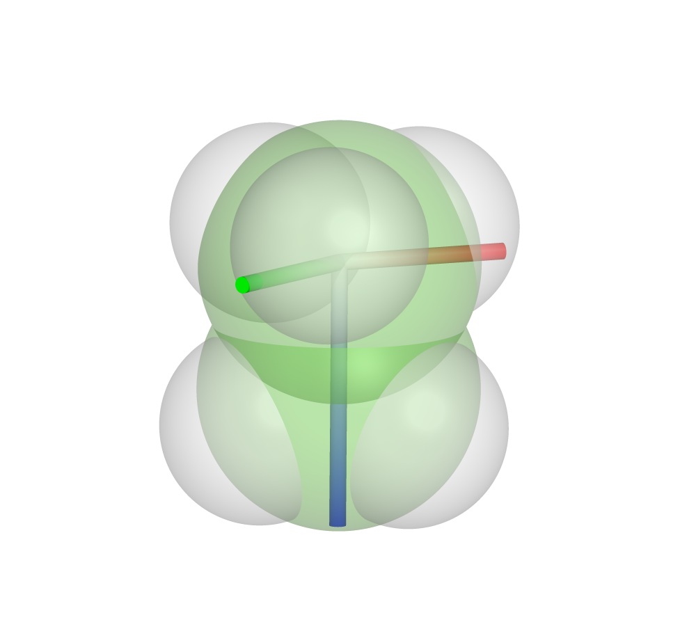
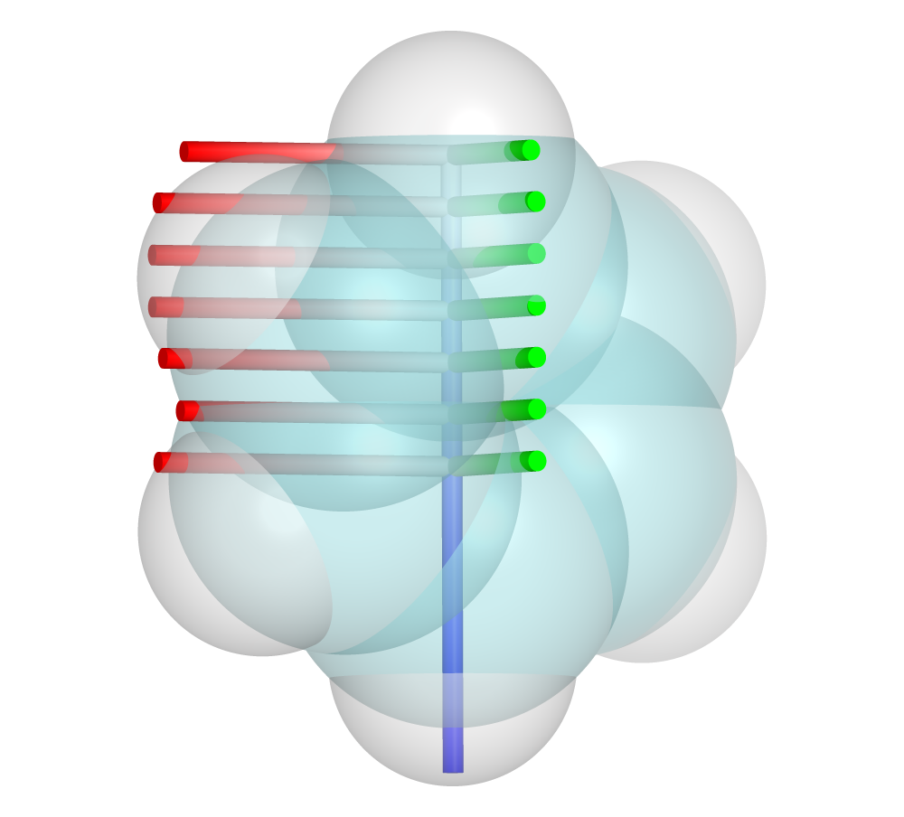
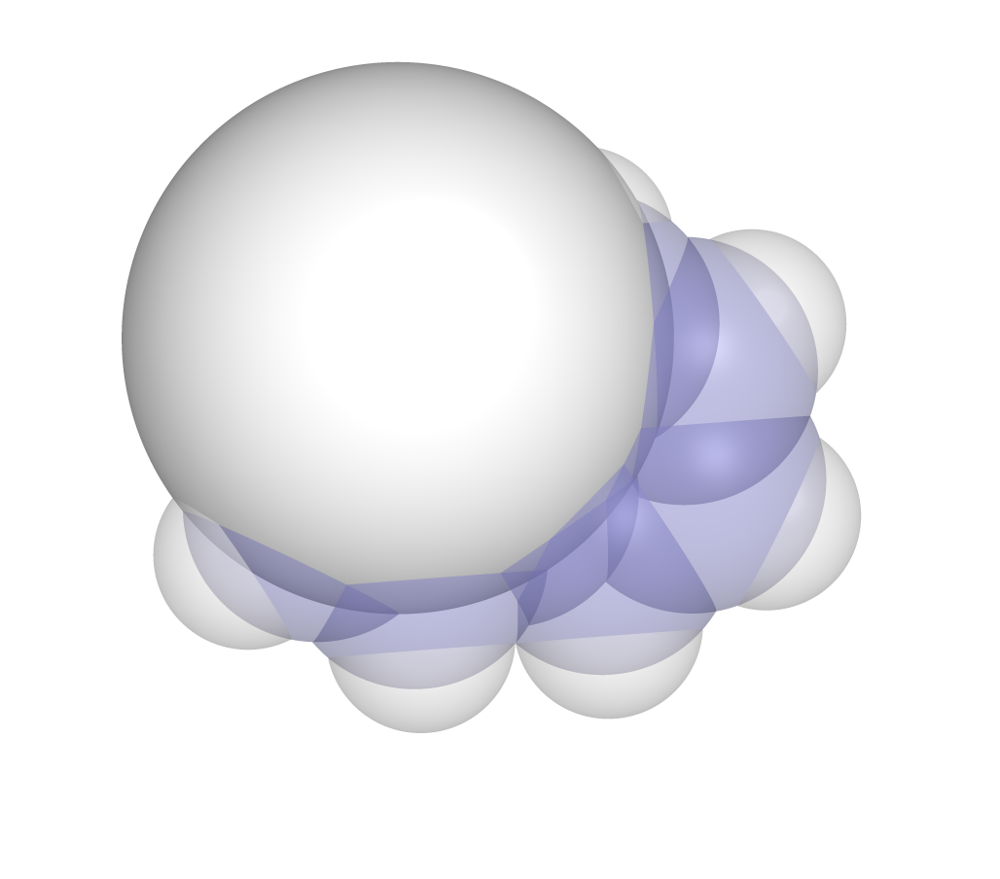

===

# DBSTEP
DFT-based Steric Parameters 

Allows a user to compute steric parameters from chemical structures. 

Calculate Sterimol parameters<sup>1</sup> (L, Bmin, Bmax), %Buried Volume<sup>2</sup>, Sterimol2Vec and Vol2Vec parameters

## Features
* Compute requested steric parameters from molecular structure files with input options:
    * `-s` or `--sterimol` - Sterimol Parameters (L, Bmin, Bmax) 
    * `-b` or `--volume` - Percent Buried Volume
    * `-s` or `--sterimol` AND `--scan [rmin:rmax:interval]` - Sterimol2Vec Parameters 
    *  `-b` or `--volume`AND `--scan [rmin:rmax:interval]` - Vol2Vec Parameters
* `-r` - Adjust radius of percent buried volume measurements (default 3.5 Angstrom)
* Exclude atoms from steric measurement with `--exclude [atom indices]` option (no spaces, separated by commas)
* Steric parameters can be computed from van der Waals radii or using a three dimensional grid (default is grid).
    * Change measurement type with `--measure ['classic' or 'grid']` where classic will use vdw radii.
    * Grid point spacing can be adjusted (default spacing is 0.05 Angstrom), adjust with `--grid [# in Angstrom]`
* Steric parameters can be measured from electron density .cube files generated by Gaussian (see [Gaussian cubegen](https://gaussian.com/cubegen/) for information on how to generate these)
    * The `--surface density` command (default vdw) with a .cube input file will measure sterics from density values read in from the file.
    * Density values read from the cube file greater than a default cutoff of 0.002 determine if a molecule is occupying that point in space, this can be changed with `--isoval [number]`
* `--noH` - exclude hydrogen atoms from steric measurements
* `--addmetals` - add metals to steric measurements (traditionally metal centers are removed from steric measurements)

### 2-D Graph contribution features
* Compute graph-based steric contributions in layers spanning outward from a reference functional group with the following input options:
    * `--2d` - Toggle 2D measurements on
    * `--fg` - Specify an atom or functional group to use as a reference as a SMILES string 
    * `--maxpath` - The number of layers to measure. A connectivity matrix is used to compute the shortest path to each atom from the reference functional group. 
    * `--2d-type` - The type of steric contributions to use. Options include Crippen molar refractivities or McGowan volume

## Requirements & Dependencies
* Python 3.6 or greater
* Non-standard dependencies will be installed along with DBSTEP, but include [numpy](https://numpy.org/), [numba](https://numba.pydata.org/), [scipy](https://www.scipy.org/), and [cclib](https://cclib.github.io/).

#### Install 
- To run as a module (python -m dbstep), download this repository and install with ```python setup.py install```

## Conda and PyPI (`pip`)
- Install using conda
    `conda install -c patonlab dbstep`
- Or using pip
    `pip install dbstep`

#### Usage 
File parsing is done by the [cclib module](https://onlinelibrary.wiley.com/doi/abs/10.1002/jcc.20823), which can parse many quantum chemistry output files along with other common chemical structure file formats (sdf, xyz, pdb). For a full list of acceptable cclib file types, see their documentation [here](https://cclib.github.io/). Additionally, if used in a Python script, DBSTEP can also read coordinate information from [RDKit](https://www.rdkit.org/) mol objects if three-dimensional coordinates are present along with Gaussian 16 cube files containing volumetric density information.

To execute the program:
- Run as a command line module with: `python -m dbstep file --atom1 a1idx --atom2 a2idx`

- Run in a Python program by importing: `import dbstep.Dbstep as db` (example below)
```
    import dbstep.Dbstep as db
    
    #Create DBSTEP object
    mol = db.dbstep(file,atom1=atom1,atom2=atom2,commandline=True,verbose=True,sterimol=True,measure='classic')  
    
    #Grab Sterimol Parameters
    L = mol.L
    Bmin = mol.Bmin
    Bmax = mol.Bmax
```

DBSTEP currently takes a coordinate file (see information on appropriate file types above) along with reference atoms and other input options for steric measurement. Sterimol parameters are measured and output to the user using the `--sterimol` argument, volume parameters can be requested with the `--volume` option. 

Atoms are specified by referring to the index of an atom in a coordinate file, (ex: "2", referencing the second atom in the file, with indexing starting at 1).

For Sterimol parameters, two atoms need to be specified using the arguments `--atom1 [atom1idx]` and `--atom2 [atom2idx]`. The L parameter is measured starting from the specified atom1 coordinates, extending through the  atom1-atom2 axis until the end of the molecule is reached. The Bmin and Bmax molecular width parameters are measured on the axis perpendicular to L. 

For buried volume parameters, only the `--atom1 [atom]` argument is necessary to specify. 

If no atoms are specified, the first two atoms in the file will be used as reference. 

### Examples
Examples for obtaining Sterimol, Sterimol2Vec, Percent Buried Volume and Vol2Vec parameter sets are shown below (all example files found in examples/ directory).

1. Sterimol Parameters for Ethane
    
    Obtain the Sterimol parameters for an ethane molecule along the C2-C5 bond on the command line:
```
>>>python -m dbstep examples/Et.xyz  --sterimol --atom1 2 --atom2 5

     Et.xyz / Bmin:  1.70 / Bmax:  3.25 / L:  2.15
```
    where Et.xyz looks like: 
```
8
ethane
H	0.00	0.00	0.00
C	0.00	0.00    -1.10
H	-1.00	0.27	-1.47
H	0.27	-1.00	-1.47
C	1.03	1.03	-1.61
H	1.03	1.03	-2.71
H	2.03	0.76	-1.25
H	0.76	2.03	-1.25
```

A visualization of these parameters can be shown in the program PyMOL using the two output files created by DBSTEP, showing the L parameter in blue, Bmin parameter in green and Bmax parameter in red. 



2. Sterimol2Vec Parameters for Ph

    The `--scan` argument is formatted as `rmin:rmax:interval` where rmin is the distance from the center along the L axis to start measurements, rmax dictates when to stop measurements, and interval is the frequency of measurements. In this case the length of the molecule (~6A) is measured in 1.0A intervals

```
>>>python -m dbstep examples/Ph.xyz --sterimol --atom1 1 --atom2 2 --scan 0.0:6.0:1.0

    Ph.xyz / R:  0.00 / Bmin:  1.55 / Bmax:  2.86 
    Ph.xyz / R:  0.50 / Bmin:  1.65 / Bmax:  3.16 
    Ph.xyz / R:  1.00 / Bmin:  1.65 / Bmax:  3.16 
    Ph.xyz / R:  1.50 / Bmin:  1.65 / Bmax:  3.16 
    Ph.xyz / R:  2.00 / Bmin:  1.65 / Bmax:  3.15 
    Ph.xyz / R:  2.50 / Bmin:  1.65 / Bmax:  2.91 
    Ph.xyz / R:  3.00 / Bmin:  1.65 / Bmax:  3.16 

    L parameter is  5.95 Ang

```
 
 Displayed in PyMOL, each new Bmin and Bmax axis is added along the L axis. 
 
 
 
3. Percent Buried Volume 
 
    %Vb is measured by constructing a sphere (typically with a 3.5A radius) around the center atom and measuring how much of the sphere is occupied by the molecule. Output will include the sphere radius, percent buried volume (%V_Bur) and percent buried shell volume (%S_Bur) (zero in all cases unless a scan is being done simultaneously).
 ```
 >>>python -m dbstep examples/1Nap.xyz --atom1 2 --volume

      R/Å     %V_Bur     %S_Bur
     3.50      41.77       0.00
 ```
 
 For percent buried volume, the PyMOL script will overlay an appropriate sized sphere where measurement took place.
  
 
4. Vol2Vec Parameters
 
    When invoking the --volume and --scan parameters simultaneously, vol2vec parameters can be obtained. In this case, a scan is performed using spheres with radii from 2.0A to 4.0A in 0.5A increments. 
 ```
 >>>python -m dbstep examples/CHiPr2.xyz --atom2 2 --volume --scan 2.0:4.0:0.5

      R/Å     %V_Bur     %S_Bur
     2.00      89.45      64.59 
     2.50      73.56      53.69
     3.00      63.83      44.40
     3.50      53.41      26.75
     4.00      41.61       9.59
 ```
 
 ### Acknowledgements
 
  This work is developed by Guilian Luchini and Robert Paton and is supported by the [NSF Center for Computer-Assisted Synthesis](https://ccas.nd.edu/), grant number [CHE-1925607](https://www.nsf.gov/awardsearch/showAward?AWD_ID=1925607&HistoricalAwards=false)
  
    
  
 ### References
 
 1. Verloop, A., Drug Design. Ariens, E. J., Ed. Academic Press: New York, **1976**; Vol. III
 2. Hillier, A. C.;  Sommer, W. J.;  Yong, B. S.;  Petersen, J. L.;  Cavallo, L.; Nolan, S. P. *Organometallics* **2003**, *22*, 4322-4326.
